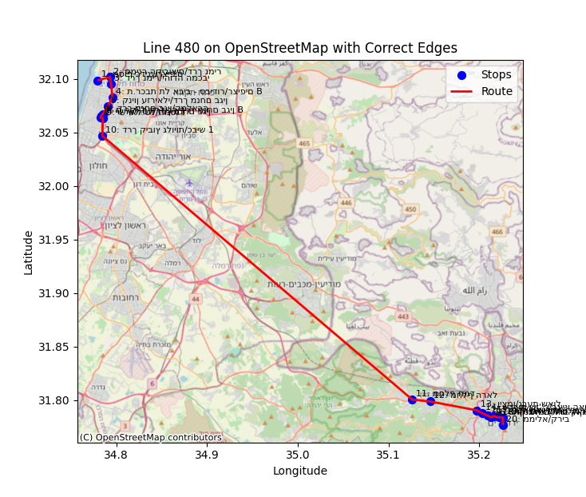
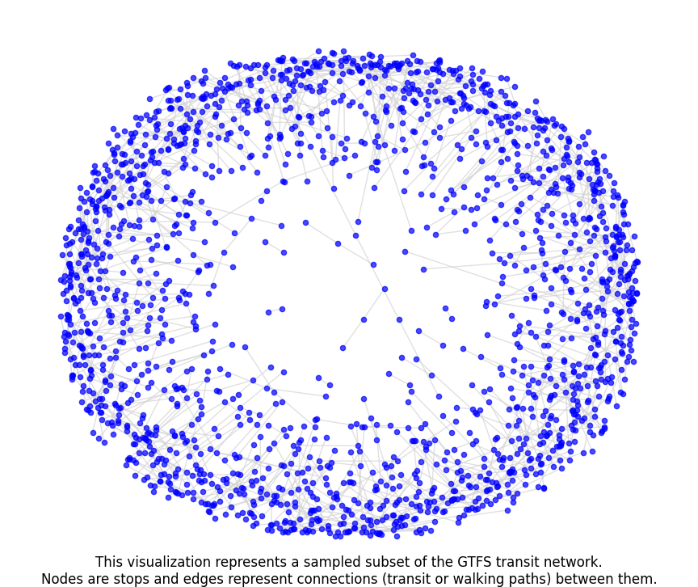
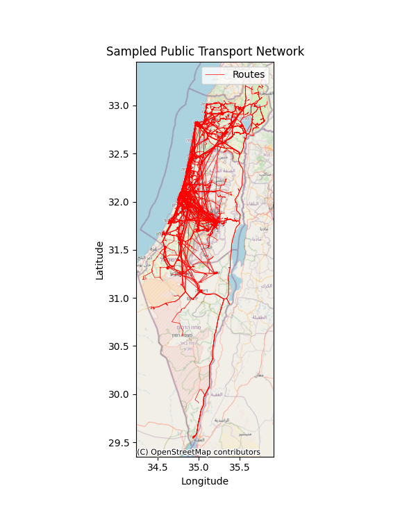

# MooveFree 🚌

[](https://opensource.org/licenses/MIT)
[](https://www.python.org/downloads/)
[](https://gtfs.org/)
[](https://github.com/Dor-sketch/MooveFree)

MooveFree is an open-source public transportation route planner for Israel, built with Python and modern web technologies. It provides an intuitive interface for finding optimal bus routes between any two stops in the Israeli public transportation network.

The application uses GTFS (General Transit Feed Specification) data to build a graph representation of the transportation network, allowing for route planning and visualization. The project aims to provide a free and accessible alternative to commercial route planning services, with a focus on user-friendly design and performance.

Stops map demo available at [https://dorpascal.com/MooveFree/](https://dorpascal.com/MooveFree/)

Navigation demo available at [https://dorpascal.com/MooveFree/map](https://dorpascal.com/MooveFree/navigation.html)

Note that the application is still under development and some features may not be fully functional.

## 🌟 Features

- Interactive map-based interface
- Real-time route planning
- Support for the complete Israeli public transportation network
- Stop search with auto-suggestions
- Visualization of routes and stops
- Multiple route alternatives
- RTL support for Hebrew

## 🖥️ Screenshots

### Map Interface


### Route Planning


### Stop Visualization


### Route Visualization



## ⚠️ Project Status

Currently in development with some features under construction:

- [ ] Graph building optimization
- [ ] Path finding between routes and destinations
- [x] Basic map visualization
- [x] Stop search functionality
- [x] Route display

### Update Log

<details>
<summary>Click to expand</summary>

#### (2024-12-26) Implemented basic path finding algorithm (WIP)

The GTFS Trip Planner calculates optimal journeys between public transit stops. Here's a summary of how it works:

1. **Data Loading**:
   - Loads GTFS datasets (`stops`, `routes`, `trips`, `stop_times`) and caches them.
   - Builds a graph where nodes are stops and edges are transit or walking connections.

2. **Network Construction**:
   - Creates connections between stops using transit schedules.
   - Adds walking connections based on proximity (calculated using the Haversine formula).

3. **Journey Planning**:
   - Finds shortest paths between start and destination stops using `networkx`.
   - For each path, selects the best trips (transit or walking) based on departure and arrival times.

4. **Trip Optimization**:
   - Prioritizes trips with minimal travel and wait times.
   - Supports walking trips when transit options are unavailable.

5. **Output**:
   - Returns a list of optimized journeys with details on total travel time and walking distance.

The current implemntation is not yet functional and requires further testing and optimization. Future updates will focus on improving path finding performance and accuracy.

Visualization of sample of the cached network:



Visualization of the network on a map:



Output from the current implementation:

<details>
<summary>Click to expand</summary>

```bash
Starting GTFS Processing Example...
Loading GTFS data...
No cached network found, building network...

Building transit network...
Creating route catalog lookup...
Creating trip-route lookup...
Processing stop_times...
100%|██████████████████████████████████| 24222018/24222018 [01:02<00:00, 387942.48it/s]

Adding walking connections...

Analyzing walking connections...
Added 1235484 walking connections

Network statistics:
- Nodes (stops): 34,405
- Edges (connections): 629,479
- Routes: 7,061
- Direct connections: 1,258,943

Caching network for future use...
✓ Network cached successfully

Finding frequently served stops...

Busiest stops:
Stop 13103 (קניון עזריאלי/דרך מנחם בגין): served by 372 routes
Stop 13322 (המסגר/המלאכה): served by 309 routes
Stop 13358 (סמינר הקיבוצים/דרך נמיר): served by 269 routes
Stop 12898 (ת.רק''ל אהרונוביץ'/דרך ז'בוטינסקי): served by 259 routes
Stop 13120 (דרך זאב ז'בוטינסקי/מכון מור): served by 249 routes
Stop 14045 (חזון אי''ש/רבנו תם): served by 240 routes
Stop 13345 (חזון אי''ש/רבי עקיבא): served by 239 routes
Stop 12910 (דרך נמיר/יהודה המכבי): served by 231 routes
Stop 29432 (רבי עקיבא/גן ורשה): served by 231 routes
Stop 14043 (חזון אי''ש/האדמו''ר מגור): served by 230 routes

Searching for journeys...

Finding paths from 14043 to 13103 starting at 08:00:00
From: חזון אי''ש/האדמו''ר מגור to קניון עזריאלי/דרך מנחם בגין
Found 31 possible paths

Analyzing path 1/31:
Stops: 14043 (חזון אי''ש/האדמו''ר מגור) -> 13338 (חזון אי''ש/הרב יעקב לנדא) -> 15989 (צומת ניר גלים) -> 15988 (צומת נווה הרצוג) -> 38936 (קניון עזריאלי/כביש 20) -> 13103 (קניון עזריאלי/דרך מנחם בגין)

  Finding connection from חזון אי''ש/האדמו''ר מגור to חזון אי''ש/הרב יעקב לנדא after 08:00:00
  Found 54 possible routes: 16072, 35812, 2429, 33267, 35995, 10549, 6616, 10531, 10535, 17011, 35707, 17845, 33268, 10526, 16907, 11597, 19577, 8657, 8656, 35708, 2428, 11625, 16203, 6642, 11623, 16073, 15521, 8663, walking, 6588, 11598, 17007, 37655, 35822, 17226, 6610, 17155, 10525, 10532, 6601, 17154, 16909, 28403, 33269, 13668, 35693, 10536, 28402, 16908, 15035, 35696, 8665, 16204, 15522
  Walking option available: 08:00:00 -> 08:04:00

Searching for trips from 14043 to 13338 after 08:00:00
Looking at routes: {'16072', '35812', '2429', '33267', '35995', '10549', '6616', '10531', '10535', '17011', '35707', '17845', '33268', '10526', '16907', '11597', '19577', '8657', '8656', '35708', '2428', '11625', '16203', '6642', '11623', '16073', '15521', '8663', '6588', '11598', '17007', '37655', '35822', '17226', '6610', '17155', '10525', '10532', '28403', '17154', '16909', '33269', '6601', '13668', '35693', '10536', '28402', '16908', '15035', '35696', '8665', '16204', '15522'}
Found 8594 departures and 5967 arrivals
Found 4292 common trips between these stops
Found 1893 trips on requested routes
Trip 3016104_231224: Departs at 09:09:13, time diff from 08:00:00 is 69 minutes
Found better trip: Route 2428, 09:09:13 -> 09:10:08
...
```

</details>

</details>

## 🛠️ Technology Stack

- Python 3.8+
- Pandas & GeoPandas
- Leaflet.js
- HTML5/CSS3
- GTFS (General Transit Feed Specification)

## 📦 Installation

1. Clone the repository

    ```bash
    git clone https://github.com/Dor-sketch/MooveFree.git
    cd MooveFree
    ```

2. Create and activate virtual environment (optional but recommended)

    ```bash
    python -m venv .venv
    source .venv/bin/activate  # On Windows: .venv\Scripts\activate
    ```

3. Install dependencies

    ```bash
    pip install -r requirements.txt
    ```

4. Download GTFS data

    ```bash
    # Create directory for GTFS data
    mkdir israel-public-transportation
    # Download and extract GTFS files into the directory
    ```

    You can find GTFS data for download at the [Israeli Ministry of Transportation website]( https://gtfs.mot.gov.il/gtfsfiles).

5. Run the application

    ```bash
    python -m http.server 8000
    ```

    Visit `http://localhost:8000` in your web browser.

## 🗺️ Usage

1. Enter your starting point in the "תחנת מוצא" field
2. Enter your destination in the "תחנת יעד" field
3. Click "חפש מסלול" to find available routes
4. View the suggested routes on the map and in the results panel

## 🤝 Contributing

Contributions are welcome! Please feel free to submit a Pull Request. For major changes, please open an issue first to discuss what you would like to change.

1. Fork the repository
2. Create your feature branch (`git checkout -b feature/AmazingFeature`)
3. Commit your changes (`git commit -m 'Add some AmazingFeature'`)
4. Push to the branch (`git push origin feature/AmazingFeature`)
5. Open a Pull Request

## 📝 License

This project is licensed under the MIT License - see the [LICENSE](LICENSE) file for details.

## 🙏 Acknowledgments

- Israeli Ministry of Transportation for providing GTFS data
- OpenStreetMap contributors
- The GTFS community

## 📧 Contact

Dor Pascal - [@Dor-sketch](https://twitter.com/DorPascalLab) | [LinkedIn](https://www.linkedin.com/in/dor-pascal/) | [dorpascal.com](https://dorpascal.com)

Project Link: [https://github.com/Dor-sketch/MooveFree](https://github.com/Dor-sketch/MooveFree)
