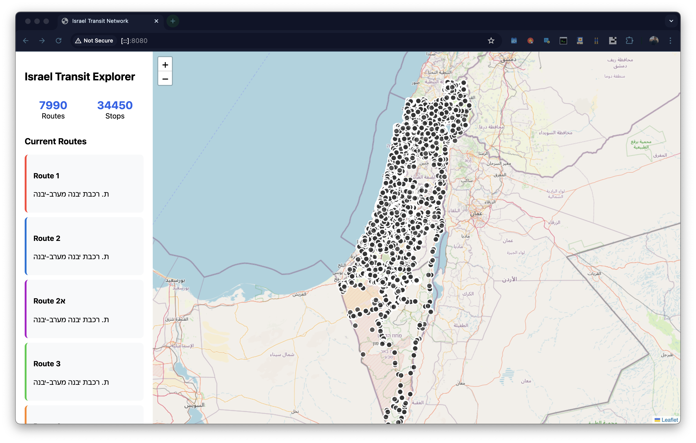

# MooveFree 🚌

[](https://opensource.org/licenses/MIT)
[](https://www.python.org/downloads/)
[](https://gtfs.org/)
[](https://github.com/Dor-sketch/MooveFree)

MooveFree is an open-source public transportation route planner for Israel, built with Python and modern web technologies. It provides an intuitive interface for finding optimal bus routes between any two stops in the Israeli public transportation network.

The application uses GTFS (General Transit Feed Specification) data to build a graph representation of the transportation network, allowing for route planning and visualization. The project aims to provide a free and accessible alternative to commercial route planning services, with a focus on user-friendly design and performance.

Stops map demo available at [https://dorpascal.com/MooveFree/](https://dorpascal.com/MooveFree/)

Navigation demo available at [https://dorpascal.com/MooveFree/map](https://dorpascal.com/MooveFree/navigation.html)

Note that the application is still under development and some features may not be fully functional.

## 🌟 Features

- Interactive map-based interface
- Real-time route planning
- Support for the complete Israeli public transportation network
- Stop search with auto-suggestions
- Visualization of routes and stops
- Multiple route alternatives
- RTL support for Hebrew

## 🖥️ Screenshots

### Map Interface



### Route Planning


### Stop Visualization


## ⚠️ Project Status

Currently in development with some features under construction:

- [ ] Graph building optimization
- [ ] Path finding between routes and destinations
- [x] Basic map visualization
- [x] Stop search functionality
- [x] Route display

## 🛠️ Technology Stack

- Python 3.8+
- Pandas & GeoPandas
- Leaflet.js
- HTML5/CSS3
- GTFS (General Transit Feed Specification)

## 📦 Installation

1. Clone the repository

    ```bash
    git clone https://github.com/Dor-sketch/MooveFree.git
    cd MooveFree
    ```

2. Create and activate virtual environment (optional but recommended)

    ```bash
    python -m venv .venv
    source .venv/bin/activate  # On Windows: .venv\Scripts\activate
    ```

3. Install dependencies

    ```bash
    pip install -r requirements.txt
    ```

4. Download GTFS data

    ```bash
    # Create directory for GTFS data
    mkdir israel-public-transportation
    # Download and extract GTFS files into the directory
    ```

    You can find GTFS data for download at the [Israeli Ministry of Transportation website]( https://gtfs.mot.gov.il/gtfsfiles).

5. Run the application

    ```bash
    python -m http.server 8000
    ```

Visit `http://localhost:8000` in your web browser.

## 🗺️ Usage

1. Enter your starting point in the "תחנת מוצא" field
2. Enter your destination in the "תחנת יעד" field
3. Click "חפש מסלול" to find available routes
4. View the suggested routes on the map and in the results panel

## 🤝 Contributing

Contributions are welcome! Please feel free to submit a Pull Request. For major changes, please open an issue first to discuss what you would like to change.

1. Fork the repository
2. Create your feature branch (`git checkout -b feature/AmazingFeature`)
3. Commit your changes (`git commit -m 'Add some AmazingFeature'`)
4. Push to the branch (`git push origin feature/AmazingFeature`)
5. Open a Pull Request

## 📝 License

This project is licensed under the MIT License - see the [LICENSE](LICENSE) file for details.

## 🙏 Acknowledgments

- Israeli Ministry of Transportation for providing GTFS data
- OpenStreetMap contributors
- The GTFS community

## 📧 Contact

Dor Pascal - [@Dor-sketch](https://twitter.com/DorPascalLab) | [LinkedIn](https://www.linkedin.com/in/dor-pascal/) | [dorpascal.com](https://dorpascal.com)

Project Link: [https://github.com/Dor-sketch/MooveFree](https://github.com/Dor-sketch/MooveFree)
